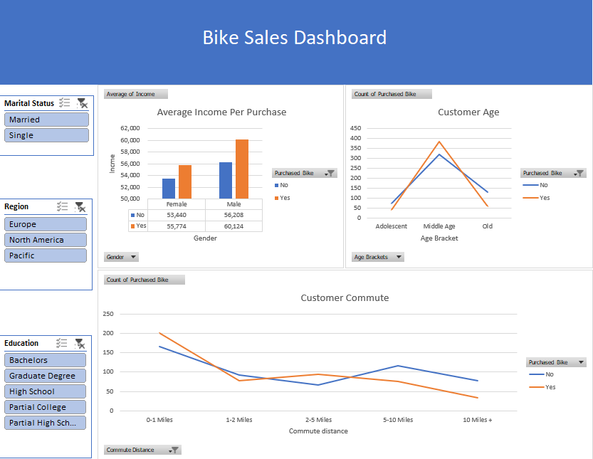

# Bike Buyers Excel Dashboard Project

## Project Overview
This project analyzes customer data to understand factors influencing bike purchases using Microsoft Excel.

## Dataset Information
Customer details include:
- Gender
- Age
- Income
- Education
- Occupation
- Region
- Commute Distance
- Purchased Bike

## Tools Used
- Microsoft Excel
- Data Cleaning
- Pivot Tables & Charts
- Dashboard Design

## Analysis Performed
- Income vs Bike Purchase
- Age Group Analysis
- Commute Distance Impact

## Files
- Bike Sales.xlsx
- Images/ (dashboard screenshots)

## 📸 Dashboard Preview

